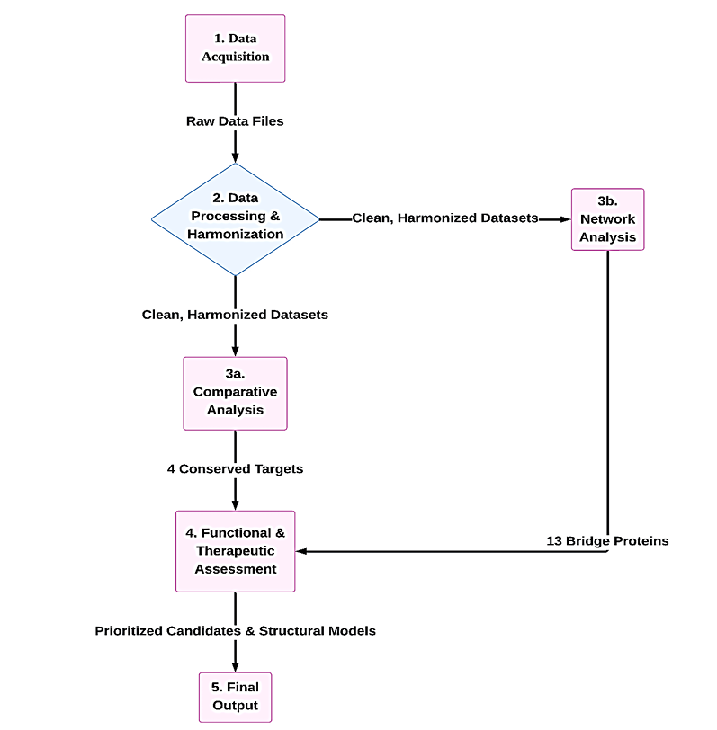
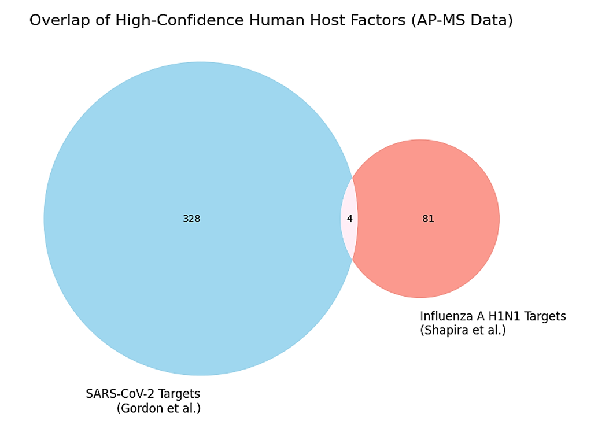
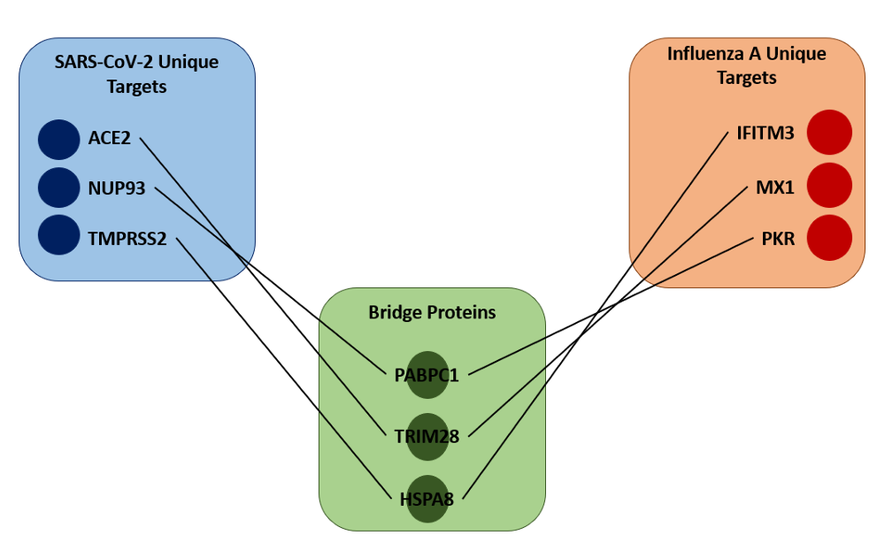
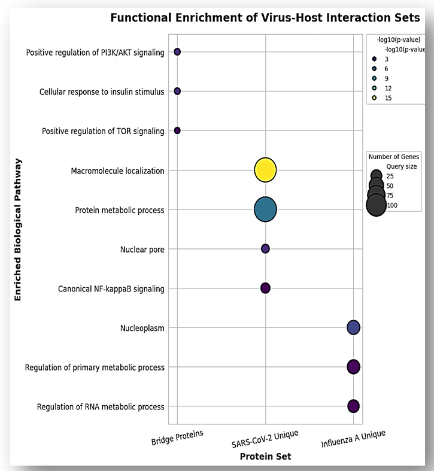
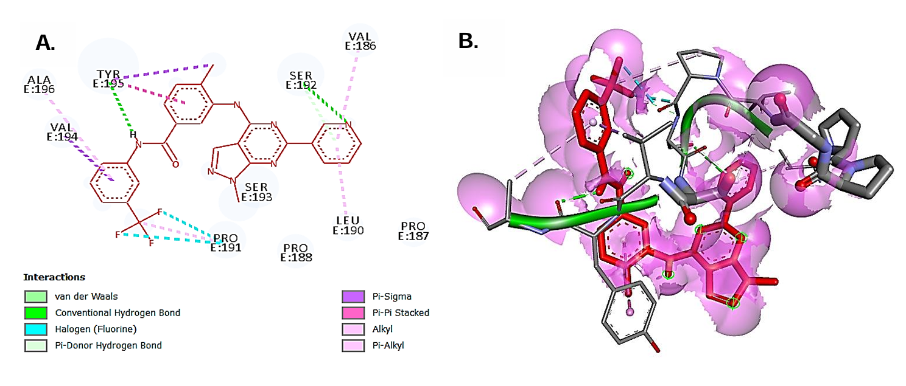

# Integrative Comparative Proteomic Analysis of Host-Virus Interactions: SARS-CoV-2 and Influenza A

   

## 📌 Project Overview
**Author:** Shashank Kashyap    

Emerging viral threats like **SARS-CoV-2** and persistent pathogens like **Influenza A Virus (IAV)** share a dependency on host cellular machinery. This project utilizes a **comparative systems biology approach** to identify "Conserved Host Dependency Factors" (HDFs)—host proteins essential for the replication of both viruses.

By integrating high-confidence AP-MS interactome data with the human physical interactome, this study identifies novel therapeutic targets that could serve as the basis for **broad-spectrum antivirals**.

---

## 🛠️ Methodology & Pipeline
The study followed a multi-stage computational workflow utilizing **Python (Pandas, Scipy)** for data processing and **NetworkX** for topological analysis.

1.  **Data Harmonization:** High-confidence interactomes (Gordon et al. for SARS-CoV-2; Shapira et al. for IAV) were mapped to UniProt IDs.
2.  **Comparative Analysis:** Identification of direct overlap (conserved targets) and statistical validation using hypergeometric testing.
3.  **Network Topology Analysis:** Development of a custom algorithm to identify **"Bridge Proteins"**—hidden connectors in the human PPI network linking disparate viral targets.
4.  **Functional Enrichment:** Pathway analysis using g:Profiler (GO, KEGG, Reactome).
5.  **Druggability Assessment & Docking:** Screening via DrugBank/ChEMBL and molecular docking simulation using **AutoDock Tools**.

 
<em>Figure 1: Computational pipeline for the identification of conserved virus-host factors.</em>

---

## 📊 Key Findings

### 1. Conserved Host Factors
Despite the differences in viral families, the analysis identified **4 highly conserved host factors** shared by both viruses: **HOOK1, MIPOL1, EXOSC8, and TCF12**.
*   *Statistical Significance:* Hypergeometric test p-value = **0.051**.

 
<em>Figure 2: Overlap of high-confidence host factors between SARS-CoV-2 and Influenza A.</em>

### 2. The "Bridge Protein" Network
A novel network analysis revealed **13 Bridge Proteins** (e.g., **TRIM28, PABPC1**) that do not directly interact with both viruses but serve as functional connectors between the two viral interactomes. This creates a hidden signaling hub centered on **PI3K/AKT** and **mTOR signaling**.

 
<em>Figure 3: Conceptual network model showing Bridge Proteins connecting unique viral targets.</em>

### 3. Functional Enrichment
Conserved and bridge proteins converged on critical biological processes, specifically **RNA metabolic processes** and **Nuclear Pore transport**, highlighting the viral strategy of hijacking host manufacturing systems.

 
<em>Figure 4: Dot plot showing distinct biological themes for bridge and virus-specific proteins.</em>

---

## 💊 Therapeutic Targets & Docking
Based on tractability scores (OpenTargets) and chemical validation (ChEMBL), **TCF12** and **EXOSC8** were prioritized as top therapeutic candidates.

**Molecular Docking Result:**
A docking simulation of **TCF12** (PDB: `1W76`) with a known small-molecule modulator revealed a stable, high-affinity interaction.
*   **Binding Energy:** -6.8 kcal/mol
*   **Mechanism:** Stable binding within a defined pocket on the protein surface.

 
<em>Figure 5: 2D Interaction map and 3D binding pose of the ligand within the TCF12 active site.</em>

---

## 🔒 Full Report Access
**This repository contains an overview of the analysis and key visualizations.** 

As this is a formal project report submitted for the award of Bachelor of Engineering, the full thesis document and code scripts are not publicly available in this repository.

**Recruiters & Academic Collaborators:**  
If you wish to review the full project report, detailed statistical analysis, or discussion on the "Bridge Protein" algorithm, please contact me directly:

📧 **Email:** kashyapshashank222@gmail.com  
🔗 **LinkedIn:** https://www.linkedin.com/in/shashank-kashyap-805309238/

---

## 📚 Tools & References
*   **Data Sources:** BioGRID, STRING DB v12.0, UniProt.
*   **Libraries:** Python (NetworkX, Matplotlib, Seaborn, Pandas).
*   **Structural Tools:** AutoDock Tools, UCSF ChimeraX, Discovery Studio Visualizer.
